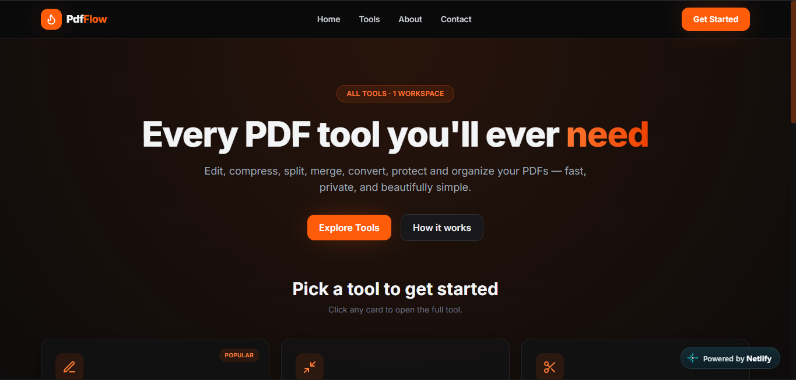
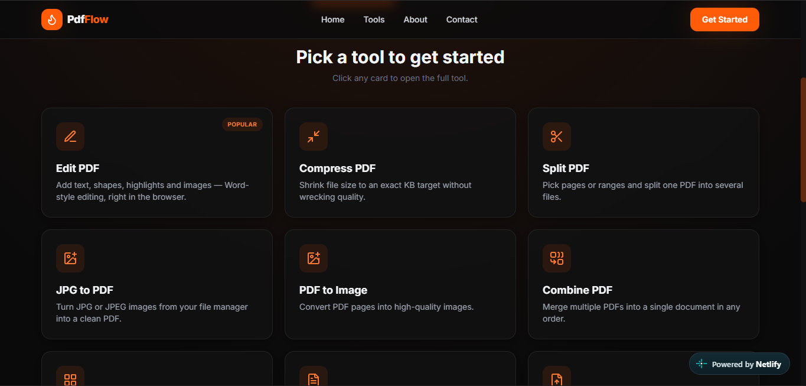

# PdfFlow

PdfFlow is a responsive PDF workspace for editing, organizing, converting, and managing documents from one place.

<p align="center">
  <a href="https://pdfs-flow.netlify.app/"><strong>Open the live demo</strong></a>
</p>

## Preview

<p align="center">
  
  
</p>

## Features

### Processed in your browser

- **Edit PDF** — add annotations and make supported text edits.
- **Compress PDF** — reduce PDF size with quality and target-size options.
- **Split PDF** — extract selected pages or page ranges.
- **Combine PDF** — merge documents and arrange their order.
- **Organize & Crop PDF** — reorder, rotate, remove, and crop pages.
- **JPG to PDF** — turn JPG or JPEG images into a PDF.
- **PDF to Image** — export PDF pages as JPG, JPEG, or PNG images.
- **Word to PDF** and **Excel to PDF** — convert documents and spreadsheets.

### Require the backend

- **PDF to Word** and **PDF to Excel** — convert PDFs with LibreOffice.
- **Protect & Unlock PDF** — apply or remove password protection with qpdf.

Files for browser-based tools stay in the browser. Backend-powered tools send the selected file to the configured PdfFlow API for processing.

## Tech stack

- **Frontend:** React, Vite, Tailwind CSS, React Router
- **Document tools:** pdf-lib, PDF.js, jsPDF, SheetJS, Mammoth
- **Backend:** Node.js, Express, MongoDB, Multer
- **Deployment:** Netlify frontend preview; Express API can be deployed separately

## Run locally

Install Node.js and npm. To use backend-powered features, also install MongoDB, LibreOffice, and qpdf.

### Frontend

```powershell
cd frontend
npm install
npm run dev
```

Vite starts the frontend at `http://localhost:5173`.

### Backend

In a second terminal:

```powershell
cd backend
npm install
Copy-Item .env.example .env
npm run dev
```

Set `MONGODB_URI` in `backend/.env` to your MongoDB connection string. MongoDB is required by the current backend routes to record conversion and protection jobs. Install LibreOffice for PDF-to-Word/Excel conversion and qpdf for PDF protection/unlocking. If qpdf is not on `PATH`, set `QPDF_PATH` in `.env` to its executable path.

The frontend's Vite `/api` proxy is configured in `frontend/vite.config.js`. Point it to `http://localhost:5000` when you want local frontend requests to use the local backend.

Create a production frontend build with:

```powershell
cd frontend
npm run build
```

## Repositories

- **Frontend:** [PdfFlow-Frontend](https://github.com/ShivamSeamar/PdfFlow-Frontend)
- **Backend:** [PdfFlow](https://github.com/ShivamSeamar/PdfFlow)

## License

This project is licensed under the MIT License. See [LICENSE](LICENSE).
